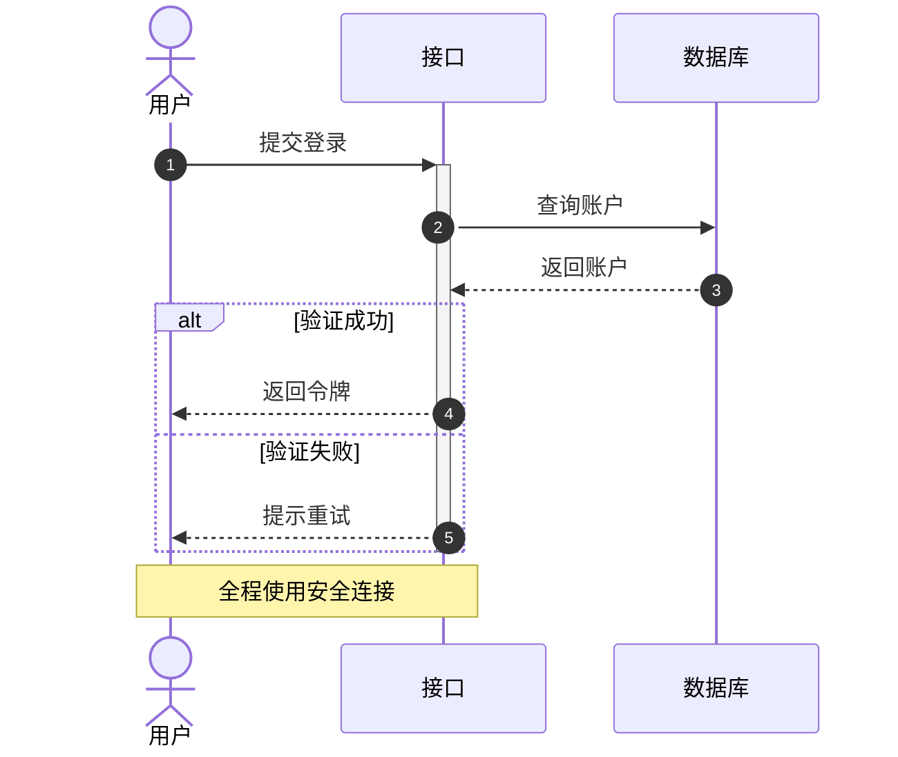
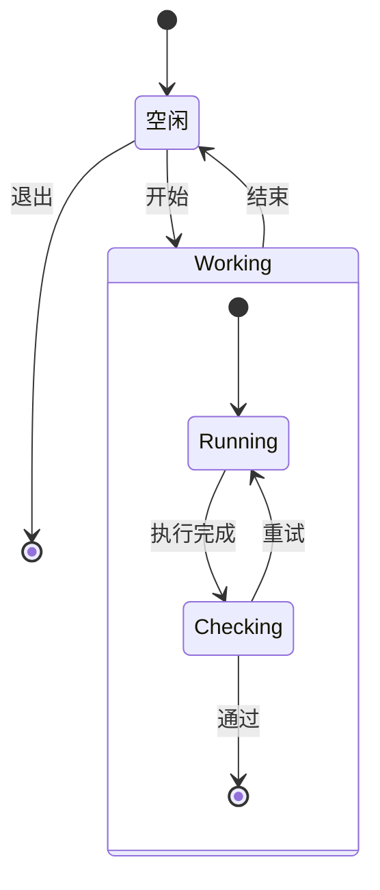
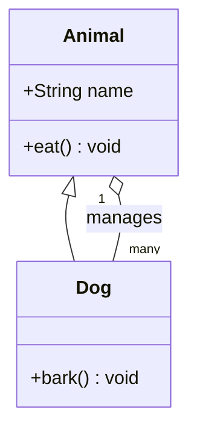
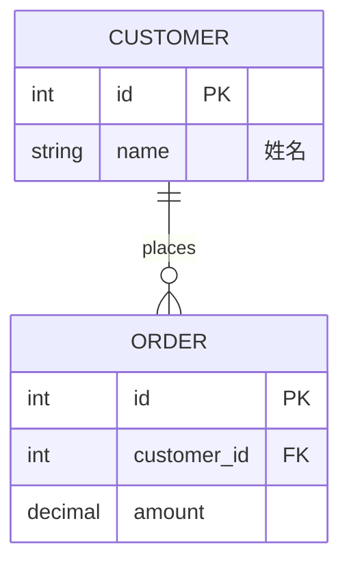
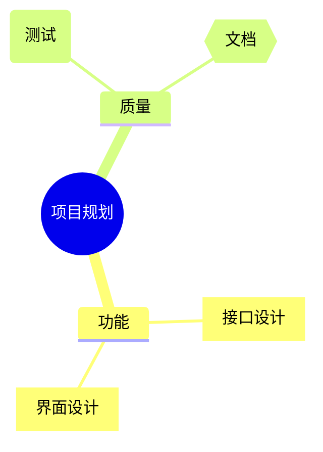
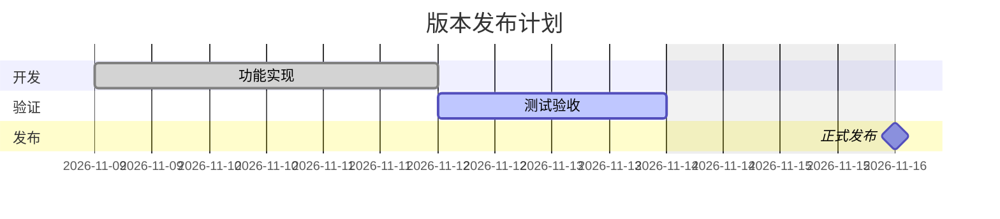

# Mermaid 渲染示例

检测到 mmdc 后自动生成图片，否则使用 mermaidtext 字符渲染。思维导图和甘特图在字符模式中显示源码。

## 时序图

```mermaid
sequenceDiagram
    autonumber
    actor User as 用户
    participant API as 接口
    participant DB as 数据库
    User->>+API: 提交登录
    API->>DB: 查询账户
    DB-->>API: 返回账户
    alt 验证成功
        API-->>User: 返回令牌
    else 验证失败
        API-->>User: 提示重试
    end
    deactivate API
    Note over User,API: 全程使用安全连接
```

## 状态图

```mermaid
stateDiagram-v2
    [*] --> Idle
    state "空闲" as Idle
    Idle --> Working: 开始
    state Working {
        [*] --> Running
        Running --> Checking: 执行完成
        state Checking <<choice>>
        Checking --> Running: 重试
        Checking --> [*]: 通过
    }
    Working --> Idle: 结束
    Idle --> [*]: 退出
```

## 类图

```mermaid
classDiagram
    class Animal {
        +String name
        +eat() void
    }
    class Dog {
        +bark() void
    }
    Animal <|-- Dog
    Animal "1" o-- "many" Dog : manages
```

## ER 图

```mermaid
erDiagram
    CUSTOMER ||--o{ ORDER : places
    CUSTOMER {
        int id PK
        string name "姓名"
    }
    ORDER {
        int id PK
        int customer_id FK
        decimal amount
    }
```

## 思维导图

```mermaid
mindmap
    root((项目规划))
        功能
            api[接口设计]
            ui[界面设计]
        质量
            tests(测试)
            docs{{文档}}
```

## 甘特图

```mermaid
gantt
    title 版本发布计划
    dateFormat YYYY-MM-DD
    excludes weekends
    section 开发
    功能实现 :done, dev, 2026-11-09, 3d
    section 验证
    测试验收 :active, qa, after dev, 2d
    section 发布
    正式发布 :milestone, release, after qa, 0d
```
